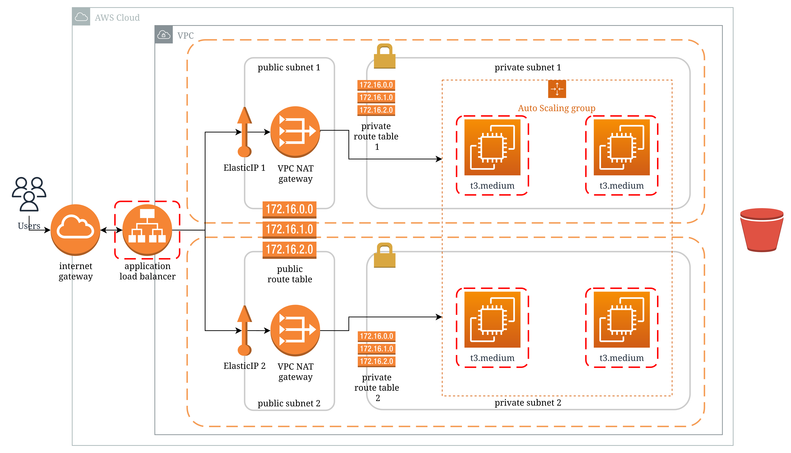

## egFWD Advanced Cloud DevOps project 2:
# Deploy a High-Availability Web App using CloudFormation
## Infrastructure Diagram

---
## Project specifications
### The Basics
|CRITERIA|SPECIFICATIONS|MEETS SPECIFICATIONS|
|---|---|---|
|Parameters| The more the better, but an exaggerated number of parameters can be messy ( say, 10 or more ). 1 or 0 is definitely lacking.|✓
|Resources|This is the mandatory section of the script, we are looking for a LoadBalancer, Launch Configuration, AutoScaling group a health check, security groups and a Listener and Target Group.|✓|
|Outputs|This is optional, but it would be nice to have a URL here with the Load Balancer DNS Name and “http” in front of it .|✓|
|Working Test|If the student provides a URL to verify his work is running properly, it will be a page that says “it works! Udagram, Udacity”|✓|

### Load Balancer

|CRITERIA|SPECIFICATIONS|MEETS SPECIFICATIONS|
|---|---|---|
|Target Group|The auto-scaling group needs to have a property that associates it with a target group. The Load Balancer will have a Listener rule associated with the same target group|✓|
|Health Check and Listener|Port 80 should be used in Security groups, health checks and listeners associated with the load balancer|✓|

### Auto-Scaling

|CRITERIA|SPECIFICATIONS|MEETS SPECIFICATIONS|
|---|---|---|
|Subnets|Students should be using PRIV-NET ( private subnets ) for their auto-scaling instances|✓|
|Machine Specs|The machine should have 10 GB or more of disk and should be a t3.small or better.|✓|
|SSH Key|There shouldn’t be a ‘keyname’ property in the launch config|✓|

### Bonus

|CRITERIA|SPECIFICATIONS|MEETS SPECIFICATIONS|
|---|---|---|
|Output|Any values in the output section are a bonus|✓|
|Bastion Host|Any resource of type AWS::EC2::Instance, optional, but nice to have.|–|
---
[official project review](https://htmlpreview.github.io/?https://github.com/janw4ld/IAC-egFWD/blob/main/project-review.html)